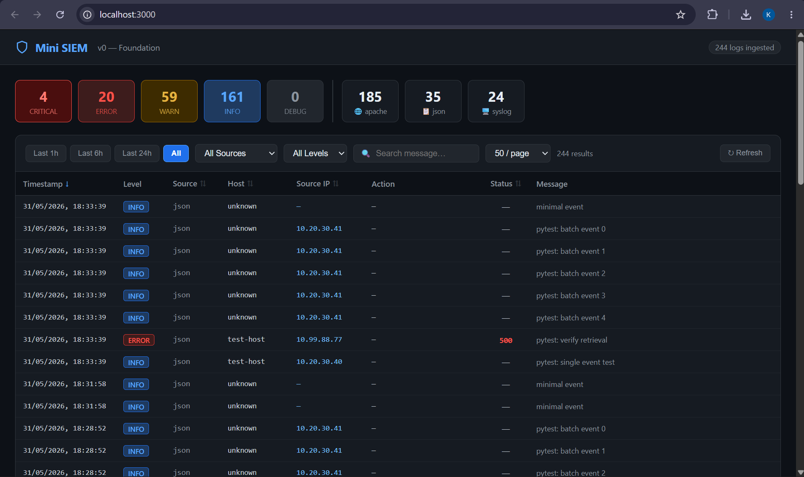
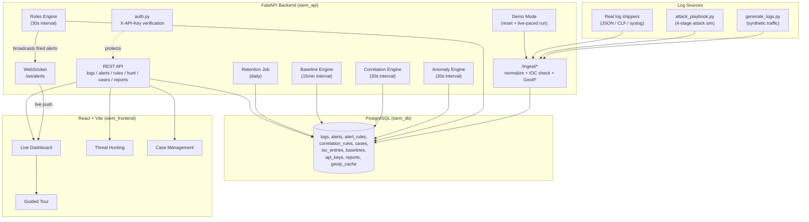

# Mini SIEM Dashboard

A lightweight, self-hosted Security Information and Event Management (SIEM) system — log ingestion, statistical anomaly detection, multi-source correlation, threat hunting, case management, and MITRE ATT&CK-mapped incident reporting, built from scratch as a portfolio demonstration of blue-team / SOC analyst engineering.



---

## Features

| Category | What it does |
|---|---|
| **Multi-format ingestion** | JSON, Apache Combined Log Format, and RFC5424/BSD syslog, normalized into one schema |
| **Alert rules engine** | 5 built-in MITRE-mapped detection rules, full CRUD API, deduplication, cooldown windows |
| **Statistical anomaly detection** | Rolling per-hour baselines flag traffic spikes, off-hours logins, new user agents, and impossible travel |
| **Multi-source correlation** | Detects multi-stage attack patterns (e.g. SSH brute force → web login attempt) across log sources |
| **IOC management** | Known-bad IP/domain/hash list with bulk upload and auto-flagging on ingestion |
| **Live dashboard** | Real-time events/minute chart, top-IPs table with GeoIP, alert counters — all WebSocket-pushed |
| **Threat hunting** | Ad-hoc filter builder (AND/OR), saved hunts, promote a hunt directly into a detection rule |
| **Case management** | Group related alerts into an investigation, add notes, track status to closure |
| **Attack pattern timeline** | Swimlane visualization for correlation-detected multi-stage attacks |
| **Incident reports** | Self-contained HTML reports with executive summary and a MITRE ATT&CK technique heatmap |
| **Attack simulation** | One-click "Run Demo" — live 4-stage attack, alerts appear on the dashboard as each stage fires |
| **Alert export** | CSV/JSON export, filterable by status |
| **Log retention** | Configurable auto-deletion of logs older than N days |
| **API key authentication** | Every endpoint (except health check and WebSocket) requires `X-API-Key` |
| **Guided tour** | First-visit walkthrough of the dashboard's core features |
| **Virtual scrolling** | Log viewer handles 300,000+ rows at a steady 58-60fps |

---

## Architecture



---

## Tech Stack

| Layer | Technology |
|---|---|
| Backend | FastAPI, SQLAlchemy, PostgreSQL, APScheduler |
| Frontend | React 18, Vite, Recharts, react-window, Shepherd.js |
| GeoIP | MaxMind GeoLite2-Country |
| Auth | SHA-256 hashed API keys |
| Testing | pytest, httpx, Locust (performance benchmarking) |
| Infrastructure | Docker Compose |

## Docker Compose Services

| Service | Image | Port | Purpose |
|---|---|---|---|
| `siem_db` | `postgres:16-alpine` | 5432 | Primary datastore |
| `siem_api` | Custom (Python 3.12-slim) | 8000 | FastAPI backend + scheduler |
| `siem_frontend` | Custom (node:22-alpine) | 3000 | React/Vite dashboard |

---

## Quick Start

### Option A — Clone and build

```bash
git clone https://github.com/Kaldeo1666/mini-siem-dashboard.git
cd mini-siem-dashboard
docker compose up --build
```

### Option B — Pull pre-built images from Docker Hub

```bash
docker pull kaldeo/mini-siem-api:latest
docker pull kaldeo/mini-siem-frontend:latest
```

**Note on platform support:** these images are published for `linux/amd64` only. An initial multi-arch (`amd64` + `arm64`) build was attempted but the arm64 leg took 45+ minutes under QEMU emulation without completing (compiling `psycopg2`/`gcc` under cross-platform emulation is disproportionately slow) — amd64-only was the pragmatic choice for a portfolio project rather than an indefinite build. Apple Silicon users can still run these via Docker Desktop's built-in Rosetta emulation at the runtime level, which is much faster than build-time QEMU emulation.

See `docker-compose.yml` for the full service configuration (database, environment variables, ports) if running the pulled images directly rather than via `docker compose up --build`.

Open **http://localhost:3000**.

The stack seeds itself automatically on first boot: 5 built-in detection rules, 2 correlation rules, a threat-intel IOC list, and a default development API key.

### API Key Setup

A development key is seeded automatically from the `DEFAULT_API_KEY` environment variable in `docker-compose.yml` (used by the frontend, test suite, and helper scripts out of the box — no manual setup needed for local development).

To issue a new API key (protected by `MASTER_API_KEY`):

```bash
curl -X POST http://localhost:8000/auth/keys \
  -H "X-Master-Key: <your-master-key>" \
  -H "Content-Type: application/json" \
  -d '{"name": "my-new-key"}'
```

The raw key is returned once, at creation — it cannot be retrieved again afterward.

> **Note:** the default dev keys committed in `docker-compose.yml` are placeholder values for local development only. If deploying publicly, override `DEFAULT_API_KEY` and `MASTER_API_KEY` with real secrets — see the deployment section below (or `docs/demo-script.md` once V5 deployment work lands).

### Generate Traffic

```bash
docker exec siem_api python scripts/generate_logs.py --rate 500 --count 5000
```

### Run the Attack Simulation

Either click **"▶ Run Demo"** in the dashboard, or from the command line:

```bash
docker exec siem_api python scripts/attack_playbook.py --api http://localhost:8000
```

### Run Tests

```bash
docker exec siem_api pytest tests/ -v
```

---

## Project Structure

mini-siem-dashboard/
├── backend/
│ ├── main.py # App entrypoint, scheduler, router registration
│ ├── models.py # SQLAlchemy ORM models
│ ├── database.py # Engine/session setup
│ ├── auth.py # API key verification
│ ├── engine.py # Alert rules evaluation
│ ├── anomaly_engine.py # Statistical anomaly detection
│ ├── correlation_engine.py # Multi-source correlation
│ ├── baseline_engine.py # Rolling baseline computation
│ ├── retention.py # Log retention job
│ ├── demo.py # Demo mode (reset + live attack run)
│ ├── ws_manager.py # WebSocket broadcast manager
│ ├── geoip/resolver.py # GeoIP lookup + caching
│ └── routers/ # One router per resource
├── frontend/
│ └── src/
│ ├── App.jsx
│ ├── theme.js # Shared color palette
│ └── components/ # One component per feature
├── scripts/
│ ├── generate_logs.py # Synthetic traffic generator
│ ├── attack_playbook.py # 4-stage attack simulation
│ └── locustfile.py # Performance benchmark
├── tests/ # Full pytest suite
├── db/init.sql # Schema
├── docker-compose.yml
└── progress.md # Full build log, V0 through V5

---

## Contributing

This is a personal portfolio project, but issues and suggestions are welcome. If you'd like to extend it:

1. Fork the repo
2. Create a feature branch (`git checkout -b my-feature`)
3. Run the test suite before opening a PR: `docker exec siem_api pytest tests/ -v`
4. Update `progress.md` with what changed and why

## License

MIT — see [LICENSE](LICENSE).